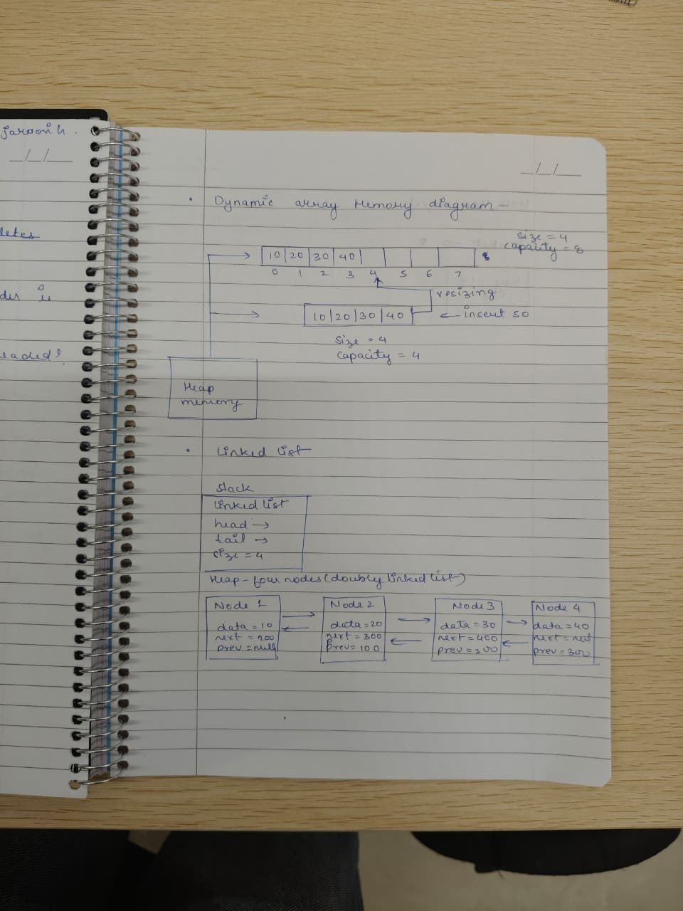
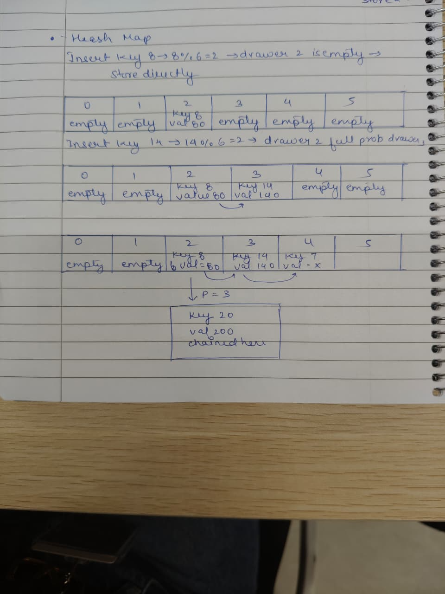

# Design Proposal — Collections Library
## Section 1- Public API 
### Dynamic Array
Creating a dynamic array that can store any data type and let T represent that particular type- template<typename T> class dynamic array.
#### Core Operations
- void append(T value) — Adds value to the end; may trigger a capacity resize.
- void insert(int index, T value) — Inserts value at the given index, shifting all subsequent elements right.
- void remove(int index) — Removes element at index, shifting subsequent elements left.
- T get(int index) — Returns the element; throws std::out_of_range if index is out of bounds.
- int size() — Returns the current element count.
- int capacity() — Returns the current allocated capacity.
#### Utility & Algorithm Operations
- int find(T value) — Returns the index of the first occurrence of value; returns -1 if not found. Requires T to support operator==.
- int count(T value) — Returns the number of elements equal to value. Requires operator==. 
- void reverse() — Reverses all elements in-place by swapping from both ends toward the centre. O(N), no extra allocation. 
- T min_element() — Returns the smallest element in the array. Requires T to support operator<. Throws std::runtime_error if the array is empty. 
- T max_element() — Returns the largest element. Same constraint as min_element.
- bool equal(const DynamicArray<T>& other) — Returns true if both arrays have the same size and every corresponding pair of elements compares equal. Requires operator==.  
- int mismatch(const DynamicArray<T>& other) — Returns the index of the first position where the two arrays differ; returns -1 if they are equal up to the shorter length.  
- void swap(DynamicArray<T>& other) — Swaps the internal buffer pointer, size, and capacity with another DynamicArray in O(1) — no element copying.  
- void clear() — Resets size to 0 without releasing the allocated buffer. Capacity is preserved to avoid unnecessary re-allocation on re-use. 
- bool contains(T value) — Returns true if value is present. Convenience wrapper around find(). Requires operator==. 
- void shrinktoFit() - Reduces the cpacity to exactly size. Called only when user is certain no more elements will be added. If they append again afterwards, the noemal doubling resize fires automatically
#### Memory Management
- ~DynamicArray() — Destructor — frees the heap buffer.
- DynamicArray(const DynamicArray<T>&) — Copy constructor — deep copies all T elements into a fresh allocation.
- operator=(const DynamicArray<T>&) — Copy assignment — self-assignment safe; deep copies via copy-and-swap idiom.

    
### Linked List
template<typename T>  class LinkedList- Creating a linked list that can store any data type and let T represent that particular type.
The Linked List is a simple class that supports both singly-linked and Doubly-Linked behaviour controlled by a bool isDoubly passed during ondtruction and this eliminates code duplication, where all menthods and functions are written once so as not to make the code redundant. 

#### Core Operations
- void insertFront(T value) — Inserts at head. O(1) always.
- void insertBack(T value) — Inserts at tail. O(1) always — tail pointer maintained in both modes.
- void deleteFront() — Removes head node. O(1) always.
- void deleteBack() — isDoubly=true: O(1) via prev pointer. isDoubly=false: O(N) walk from head to find predecessor.
- void insert(int index, T value) — Inserts at position index. O(1) at ends, O(N) interior.
- bool search(T value) — Returns true if value found. Requires operator==.
- int size() — Returns node count.
- void print() — Prints all values forward. Requires operator<<.
#### Utility & Algorithm Operations
- int find(T value) — Returns zero-based index of first match; -1 if not found. Requires operator==. 
- int count(T value) — Counts nodes equal to value. Requires operator==. 
- void reverse() — Rewires every node's next/prev pointers in-place. O(N), O(1) space. 
- bool contains(T value) — Boolean wrapper around search(). Requires operator==. 
#### Memory Management
- ~LinkedList() — Destructor — walks list and deletes every node.
- LinkedList(const LinkedList<T>&) — Copy constructor — allocates new nodes, copies all T values.
- operator=(const LinkedList<T>&) — Copy assignment — self-assignment safe deep copy.

    
### Hash Map 
#### Core Operations
- void set(K key, V value) — Inserts pair or overwrites value if key exists. Triggers rehash if load factor exceeds 0.7.
- V get(K key) — Returns value; throws std::out_of_range if key absent.
- bool exists(K key) — Returns true if key is present.
- void remove(K key) — Removes entry with given key.
- int size() — Returns number of stored key-value pairs.
- float loadFactor() — Returns size / bucket_count.
#### Utility & Algorithm Operations
- DynamicArray<K> keys() — Returns all current keys as DynamicArray<K>. Order not guaranteed.  [NEW]
- DynamicArray<V> values() — Returns all current values as DynamicArray<V>. Order not guaranteed.  [NEW]
- void merge(const HashMap<K,V>&) — Inserts all entries from other. Existing keys are NOT overwritten.  [NEW]
- bool contains(K key) — Alias for exists(). Consistent naming across the library.  [NEW]
- void clear() — Removes all entries, resets size to 0, keeps bucket array allocated.  [NEW]
#### Memory Management
- ~HashMap() — Destructor — frees bucket array and all chain nodes.
- HashMap(const HashMap<K,V>&) — Copy constructor — new bucket array, deep copies every chain.
- operator=(const HashMap<K,V>&) — Copy assignment — self-assignment safe deep copy.

## Section 2
### Dynamic Array and Linked List

### Hash Map

## Section 3
### DynamicArray Complexity Estimates
| Method | Time Complexity | Explanation |
|----------|----------------|-------------|
| `append(T value)` | O(1) amortised | Direct insertion into the next free slot. When capacity becomes full, the array size doubles and all elements are copied to a larger buffer. Although resizing takes O(N), it happens infrequently, giving O(1) amortised time per append. |
| `get(int index)` | O(1) | Elements are stored contiguously in memory, allowing direct access using pointer arithmetic. |
| `insert(int index, T value)` | Best: O(1)   Avg/Worst: O(N) | Insertion at the end is O(1). Insertion at any other position requires shifting subsequent elements one position to the right. |
| `remove(int index)` | Best: O(1)   Avg/Worst: O(N) | Removing the last element is O(1). Removing from the middle requires shifting remaining elements to fill the gap. |
| `shrinkToFit()` | O(N) | Allocates a new buffer exactly equal to the current size, copies all elements, and releases the old memory block. |
| `find(T value)` | Best: O(1)   Worst: O(N) | Performs a linear search and stops immediately when the value is found. |
| `count(T value)` | O(N) | Visits every element and counts occurrences of the specified value. |
| `reverse()` | O(N) | Swaps elements from both ends toward the centre. Requires approximately N/2 swaps and no extra memory. |
| `min_element()` | O(N) | Scans all elements once to find the smallest value. |
| `max_element()` | O(N) | Scans all elements once to find the largest value. |
| `equal(DynamicArray& other)` | O(N) | Compares corresponding elements of both arrays and stops at the first mismatch. |
| `mismatch(DynamicArray& other)` | Best: O(1)   Worst: O(N) | Returns the index of the first differing element. Stops immediately when a mismatch is found. |
| `swap(DynamicArray& other)` | O(1) | Exchanges internal pointers, size, and capacity values without moving elements. |
| `clear()` | O(1) | Resets the size counter to zero without deallocating memory. |
| `contains(T value)` | Best: O(1)   Worst: O(N) | Uses `find()` internally to determine whether the value exists in the array. |

### Linked List Complexity Estimates 
| Method | Time Complexity | Explanation |
|----------|----------------|-------------|
| `insertFront(T value)` | O(1) | Inserts a new node at the beginning of the list by updating the head pointer. |
| `insertBack(T value)` | O(1) | Inserts a new node at the end using the maintained tail pointer. No traversal is required. |
| `deleteFront()` | O(1) | Removes the head node by advancing the head pointer to the next node. |
| `deleteBack()` *(Doubly Linked List)* | O(1) | Uses the `prev` pointer of the tail node to directly access its predecessor and update the tail. |
| `deleteBack()` *(Singly Linked List)* | O(N) | Since nodes do not store a `prev` pointer, the list must be traversed from the head to find the node before the tail. |
| `insert(int index, T value)` | Best: O(1)   Avg/Worst: O(N) | Insertion at the head or tail is O(1). Insertion at an interior position requires traversal to the target index. |
| `search(T value)` | Best: O(1)   Worst: O(N) | Traverses the list node by node until the value is found or the end is reached. |
| `find(T value)` | Best: O(1)   Worst: O(N) | Returns the position of the first occurrence of the value. Stops immediately when found. |
| `contains(T value)` | Best: O(1)   Worst: O(N) | Checks whether a value exists in the list by performing a linear search. |
| `count(T value)` | O(N) | Traverses the entire list and counts all occurrences of the specified value. |
| `reverse()` | O(N) | Visits each node once, reverses the links between nodes, and swaps the head and tail pointers. Requires O(1) extra space. |

### HashMap Complexity Estimates
| Method | Time Complexity | Explanation |
|----------|----------------|-------------|
| `set(K key, V value)` | Best/Avg: O(1)   Worst: O(N) | Computes the bucket index using the hash function and inserts or updates the key-value pair. Average performance is constant time; worst case occurs when many keys collide. |
| `get(K key)` | Best/Avg: O(1)   Worst: O(N) | Locates the key using hashing and returns its associated value. Worst case occurs when collisions force traversal of a long chain. |
| `exists(K key)` | Best/Avg: O(1)   Worst: O(N) | Checks whether a key is present in the map. Average lookup is constant time due to hashing. |
| `remove(K key)` | Best/Avg: O(1)   Worst: O(N) | Finds and removes the specified key-value pair. Performance depends on the number of collisions. |
| `rehash()` | O(N) | Allocates a new bucket array and re-inserts every existing key-value pair using the new bucket count. |
| `keys()` | O(N) | Traverses all buckets and chains, collecting every key into a `DynamicArray<K>`. |
| `values()` | O(N) | Traverses all buckets and chains, collecting every value into a `DynamicArray<V>`. |
| `merge(HashMap& other)` | O(M) | Inserts all entries from the other map. Each insertion is O(1) on average, giving O(M) for M entries. |
| `contains(K key)` | Best/Avg: O(1)   Worst: O(N) | Checks whether a key exists by delegating to `exists()`. |
| `clear()` | O(N) | Removes all stored key-value pairs by traversing every bucket and chain. The bucket array itself is retained for future use. |

## Section 4 — Design Decisions
### Dynamic Array
- Capacity doubling over a fixed increment, because growing capacity by a fixed amount let say +1 or +4 on every resize and appending N elements would then trigger O(N) resizes, each copying up to N elements, giving O(N^2) total copy work while Doubling grows the array capacity geometrically so the total number of resizes across N appends is O(log N) and the total copy work across all of them is O(N), which is what makes amortized O(1) append possible at all. 
- I also considered *3 or *4 instead of doubling but on appending it will simply have lot of unused memory. Also if we initiate *1.5 resizing factor it will bring the capacity into floating point that will eventually slow out the performance. 
- The array starts at a small initial capacity (e.g. 2 or 4) rather than 0, for this particular design I took 4 as the base case because of it's resizing advantage and the very first append dosen't need a specific empty buffer case. 
- Finally, the capacity shrinks when the user explicitly calls shrinkToFit() instead of automatic shrinking so as to avoid thrashing problem. This method is called by the user when they are certain that there are no more elements will be added. If they append afterwards then normal double resizes takes place.
- Using Template T to make the data type generic and use any data type.

### Linked List - Doubly link list chosen over singly link list.
- The initial approach considered creation of one doubly link list, but if the requirement was of singly link list then creation of two separate classed will produce redundant code, every method will be copy paste identically into both classes. Any future changes or bug fix would need to be applied in two places. 
- The chosen solution is a singly LinkedList<T> class with a bool isDoubly flag set at construction time, All methods are written exactly once. The node struct always carries next and prev pointers when isDoubly is false then the previous pointer is never written or read.

### HashMap — hybrid bounded probing with chaining fallback, P = 3
- Pure separate chaining always resolves a collision by extending the home bucket's chain, pure linear probing always tries to find the next free available slot to store the element. Use of hybrid of linear probing and seperate chaining avoids problems such as clustring by checking a small window of P=3 buckets. P=3 was chosen by wighing marginal benefit against marginal cose ratherr than just picking arbitrarily. The probability a given bucket is already occupied is roughly 50% using the standard approximation. Each additional prob slot costs one more bucket check on every future operation. Approx probability of fallback to chaining depending upon the value of P are stated as follows: For P=1 ->50% P=2 -> ~25%, P=3 -> ~13%, P=4 -> ~6%.
-  As more elements are inserted, collisions become more frequent and to maintain a good performance, the HashMap automatically resizes when the load factoe exceeds 0.7, meaning the hash map will resize reaching 70% of size. 
(Load Factor = Number of elements/Number of Buckets). Doubling the size reduces collisiond and keeps operations fast.
- The bucket count is increased by *2 instead of *1.5 or 3x as only few resizes are needed, bucket count remains a power of two. Index calculation becomes faster internally as there is no floating point number. Also overall performance remains consostent as the map grows.

### Error Handling Strategy
Instead of returning confusing "sentinel values" like -1 or an empty string ("") when a lookup fails, this library throws clear exceptions across all data structures. The problem with using sentinel values is that they can easily be confused with actual data—for instance, a user might legitimately want to store -1 in an array or an empty string as a value in a hash map. By throwing a std::out_of_range error instead, the library fails loudly and immediately at the exact moment a mistake happens. Keeping this behavior consistent across both DynamicArray and HashMap makes the code reliable and easy to debug.

### Memory Management and Copying Strategy
Since our structures manage raw heap memory using pointers, relying on default shallow copies is highly dangerous. A shallow copy only copies the memory address pointer, meaning two separate objects end up sharing the exact same block of heap memory. This guarantees a catastrophic "double-free" crash the moment both objects go out of scope and try to delete the same memory space. To prevent this, the library enforces explicit deep copies for all copy constructors and assignment operators. Even though copying elements one-by-one into a freshly allocated block costs O(n) time, it is the only way to ensure each object has independent memory ownership and a safe lifetime.